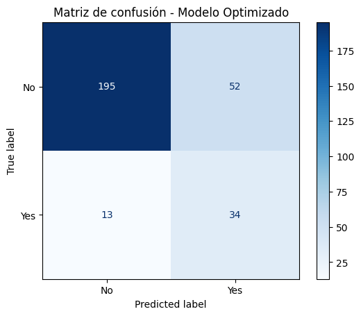
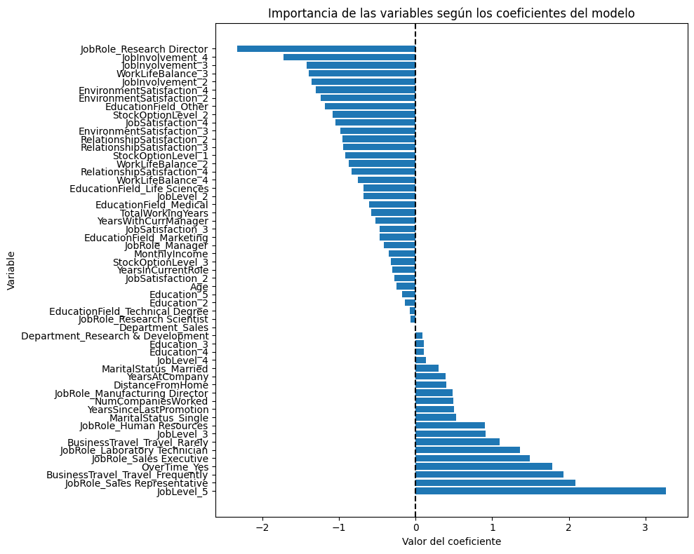

# Predicción de Rotación de Empleados (Churn Laboral)

## Descripción del proyecto  

En este proyecto estoy desarrollando un modelo de Machine Learning para predecir qué empleados tienen mayor probabilidad de abandonar una empresa. Esta herramienta está diseñada para departamentos de recursos humanos que buscan anticiparse a la rotación laboral y aplicar estrategias de retención basadas en datos objetivos. La rotación de empleados puede suponer un alto coste económico y de productividad para las organizaciones, por lo que contar con un modelo predictivo permite tomar decisiones más informadas en aspectos clave como contratación, clima laboral, desarrollo profesional y promociones. 

Para ello, estoy combinando técnicas de aprendizaje supervisado y no supervisado; en la parte supervisada estoy entrenando modelos para predecir la probabilidad de abandono, mientras que en la parte no supervisada aplico clustering para identificar perfiles o grupos de empleados según sus características, apoyándome además en reducción de dimensionalidad para facilitar la visualización. Este enfoque me está permitiendo anticipar la rotación laboral y entender mejor los distintos perfiles dentro de la empresa, apoyando estrategias de retención basadas en datos.

---

## Dataset empleado  

He utilizado el dataset público **IBM HR Analytics Employee Attrition Dataset**, disponible en Kaggle, que contiene información de 1.470 empleados, con variables demográficas, laborales, de rendimiento y satisfacción. La variable objetivo es `Attrition`, que indica si el empleado ha dejado la empresa.

Puedes acceder al dataset en el siguiente enlace:  
[IBM HR Analytics - Kaggle](https://www.kaggle.com/datasets/pavansubhasht/ibm-hr-analytics-attrition-dataset)

### Variables destacadas:  
- Edad, sexo, estado civil  
- Departamento, puesto, salario, tiempo en la empresa  
- Nivel de satisfacción, número de proyectos, evaluaciones  
- Balance vida-trabajo, horas extra  
- Variable objetivo: `Attrition` (Sí/No)

---

## Solución adoptada  

Para resolver el problema, utilizo una combinación de técnicas de aprendizaje supervisado y no supervisado:

- Clasificación supervisada: entreno modelos como Regresión Logística, Random Forest y XGBoost para predecir si un empleado se marchará o no.  
- Segmentación no supervisada: aplico clustering (KMeans y/o HDBSCAN) para identificar perfiles de empleados según características como la satisfacción, el rendimiento o la antigüedad.  
- Reducción de dimensionalidad (PCA o t-SNE) para visualizar los clusters de empleados de forma más clara.  
- Evaluación con métricas como Accuracy, Recall, F1-score y AUC-ROC.  
- Interpretación del modelo para entender qué variables influyen más en la rotación.

Este enfoque permite combinar predicción y análisis estratégico del capital humano.

---

## Estructura del repositorio  

ML_ChurnLaboral_MariaJoseCamacho/  

├── src/                       # El directorio source que debe contener al resto de carpetas                   
│   ├── data_sample/           # Muestra reducida del dataset para subir al repositorio                              
│   ├── img/                   # Imágenes que hayas  utilizado para tu proyecto                                   
│   ├── models/                # Modelos entrenados guardados (pkl, joblib...)                             
│   ├── notebooks/             # Notebooks usados para pruebas y desarrollo                               
│   └── utils/                 # Módulos o funciones auxiliares del proyecto                       
├── README.md                  # Documentación general del proyecto                     
├── main.ipynb                 # Notebook principal con el proceso completo                  
├── presentación.pdf           # Documento soporte para la exposición de resultados                  

---

## Métricas y evaluación  

Para evaluar la calidad del modelo, utilizo:
 
- **Recall**: de los empleados que realmente se fueron, cuántos detectó el modelo.  

También analizo la **importancia de las variables** y visualizo los resultados para entender el comportamiento del modelo y generar conclusiones prácticas para recursos humanos.

---

## Recomendaciones futuras  

Este modelo puede ampliarse con más datos reales, incorporar datos de encuestas internas o de clima laboral, y conectarse a sistemas de RRHH en tiempo real para automatizar alertas de riesgo de abandono.

### Resultados tras la optimización del modelo:

Classification Report - Modelo Optimizado (Logistic Regression):

              precision    recall  f1-score   support

          No       0.94      0.79      0.86       247
         Yes       0.40      0.72      0.51        47

    accuracy                           0.78       294
   macro avg       0.67      0.76      0.68       294
weighted avg       0.85      0.78      0.80       294

---
### Matriz de confusión del modelo optimizado

La siguiente gráfica muestra la matriz de confusión del modelo optimizado. Se observa que el modelo consigue detectar correctamente la mayoría de empleados que se quedan (clase "No") y un buen número de los que se marchan (clase "Yes"), lo que refleja un buen equilibrio en el rendimiento:

---

## Interpretabilidad del modelo

Gracias al uso de Regresión Logística como modelo final, ha sido posible interpretar fácilmente la influencia de cada variable en la predicción de rotación.

Se han extraído los coeficientes del modelo y se han representado gráficamente, clasificando su impacto:

- **Coeficientes positivos**: aumentan la probabilidad de rotación.
- **Coeficientes negativos**: disminuyen la probabilidad de rotación.

Esta interpretación facilita la toma de decisiones por parte de equipos de RRHH, al entender qué variables tienen más peso en la predicción.

### Importancia de las variables (coeficientes del modelo)

Este gráfico muestra la importancia de cada variable según los coeficientes de la regresión logística. Las variables con coeficiente positivo aumentan la probabilidad de que un empleado abandone la empresa, mientras que las de coeficiente negativo la reducen:

---

## Análisis no supervisado: segmentación de empleados

### Objetivo
Aplicar técnicas de aprendizaje no supervisado (clustering) para **identificar patrones y grupos ocultos** entre los empleados sin usar la variable objetivo (`Attrition`).  
Esto permite al departamento de RRHH **diseñar estrategias específicas** de retención y desarrollo según el perfil de cada grupo.

---

### Metodología

Se seleccionaron variables numéricas relevantes, se escalaron y se aplicó **PCA** para visualizar patrones.  
Se determinó el número óptimo de grupos (**k = 4**) con métodos de codo y silhouette.  
Se aplicó **KMeans** y se analizaron los perfiles y su relación con la rotación (`Attrition`).

---

### Interpretación de los perfiles de cluster (escalado 0-1)

- **Cluster 0**:  
  Perfil más joven, con poca antigüedad, pocos años con su jefe y nivel bajo de promoción. También presentan sueldos bajos. Posiblemente empleados recién incorporados o en fase inicial de carrera.

- **Cluster 1**:  
  Edad media, ingresos medios, tiempo razonable en la empresa y con su responsable. Destacan por tener el mayor porcentaje de aumento salarial. Podrían representar un perfil estable y motivado.

- **Cluster 2**:  
  Empleados mayores, con alta experiencia, antigüedad, nivel jerárquico alto y altos ingresos. Es el grupo más consolidado, probablemente cargos senior o directivos.

- **Cluster 3**:  
  Tienen también edad alta, pero menor promoción reciente, bajo crecimiento salarial y menos años con el jefe actual. Podrían estar en una fase de estancamiento o desmotivación.

---

### Porcentaje de empleados que abandonan por cluster

| Cluster | % No (Permanece) | % Yes (Abandona) |
|---------|------------------|------------------|
| **0**   | 78.86 %          | **21.14 %**      |
| **1**   | 88.16 %          | 11.84 %          |
| **2**   | 91.04 %          | 8.96 %           |
| **3**   | 93.18 %          | 6.82 %           |

---

### Conclusiones del análisis no supervisado

- El **Cluster 0** presenta el mayor porcentaje de abandono. Es un grupo de empleados más jóvenes, menos consolidados y con menor proyección.
- Los **Clusters 2 y 3** reflejan perfiles más estables y con menos probabilidad de abandonar la empresa.
- Este análisis aporta **segmentación útil para Recursos Humanos**, permitiendo anticipar la rotación y aplicar políticas diferenciadas por perfil (formación, ascensos, motivación, etc.).

## Recomendaciones futuras

Este proyecto podría ampliarse con:

- Datos reales de la empresa (más ricos y recientes).
- Incorporación de variables blandas como clima laboral, cultura organizativa o entrevistas de salida.
- Uso de interpretabilidad avanzada con SHAP o LIME.
- Automatización del scoring en tiempo real con dashboards para RRHH.

---

## Autor

**María José Camacho**  
Proyecto final del curso de Machine Learning aplicado a la empresa.

# Employee Attrition Prediction

## Project Description  

In this project, I am developing a Machine Learning model to predict which employees are more likely to leave a company. This tool is designed for human resources departments that aim to anticipate employee turnover and apply retention strategies based on objective data. Employee turnover can represent a high economic and productivity cost for organizations, so having a predictive model allows for more informed decisions in key areas such as hiring, work environment, professional development, and promotions.

To achieve this, I am combining supervised and unsupervised learning techniques; in the supervised part, I am training models to predict the likelihood of turnover, while in the unsupervised part, I apply clustering to identify employee profiles or groups based on their characteristics, also using dimensionality reduction to facilitate visualization. This approach is enabling me to anticipate turnover and better understand the different profiles within the company, supporting data-driven retention strategies.

---

## Dataset Used  

I used the public **IBM HR Analytics Employee Attrition Dataset**, available on Kaggle, which includes data on 1,470 employees and their demographic, job, performance, and satisfaction details. The target variable is `Attrition`, indicating whether an employee has left the company.

You can access the dataset here:  
[IBM HR Analytics - Kaggle](https://www.kaggle.com/datasets/pavansubhasht/ibm-hr-analytics-attrition-dataset)

### Key Variables:  
- Age, gender, marital status  
- Department, job role, salary, time at the company  
- Satisfaction level, number of projects, performance evaluations  
- Work-life balance, overtime hours  
- Target variable: `Attrition` (Yes/No)

---

## Solution Adopted  

To solve the problem, I use a combination of supervised and unsupervised learning techniques:

- **Supervised classification**: I train models like Logistic Regression, Random Forest, and XGBoost to predict whether an employee will leave.  
- **Unsupervised segmentation**: I apply clustering (KMeans and/or HDBSCAN) to group employees based on satisfaction, performance, or tenure.  
- **Dimensionality reduction** (PCA or t-SNE) is used to visualize employee clusters.  
- **Evaluation metrics**: Accuracy, Recall, F1-score, and AUC-ROC are used to measure model performance.  
- **Interpretability**: I analyze feature importance to understand which factors most influence attrition.

This approach combines predictive power with strategic workforce analysis.

---

## Repository Structure  

ML_ChurnLaboral_MariaJoseCamacho/                                                                                                               
├── src/                                     # Source directory containing the project folders                                
│ ├── data_sample/                           # Reduced version of the dataset                       
│ ├── img/                                   # Images used in the project                                    
│ ├── models/                                # Saved trained models (pkl, joblib...)                       
│ ├── notebooks/                             # Notebooks for testing and development                       
│ └── utils/                                 # Utility modules and helper functions                               
├── README.md                                # General project documentation                           
├── main.ipynb                               # Main notebook with the full process                                 
├── presentación.pdf                         # PDF file for results presentation                                 

---

## Evaluation Metrics  

To assess model performance, I use the following metrics:
  
- **Recall**: of the employees who actually left, how many the model correctly identified.  

I also analyze **feature importance** and visualize results to better understand model behavior and derive actionable insights for HR.

---

## Future Recommendations  

This model can be enhanced by:

- Including more real-world data  
- Adding internal surveys or workplace satisfaction metrics  
- Connecting to real-time HR systems for churn risk alerts  
- Deploying the model as an API for integration with HR software

### Results After Model Optimization:

Classification Report – Optimized Model (Logistic Regression):
              precision    recall  f1-score   support

          No       0.94      0.79      0.86       247
         Yes       0.40      0.72      0.51        47

    accuracy                           0.78       294
   macro avg       0.67      0.76      0.68       294
weighted avg       0.85      0.78      0.80       294

### Confusion Matrix of the Optimized Model

The following figure shows the confusion matrix of the optimized model. It can be observed that the model correctly identifies most employees who stay (class "No") and a good portion of those who leave (class "Yes"), reflecting a balanced performance:

---

## Model Interpretability

Thanks to the use of Logistic Regression as the final model, it was possible to easily interpret the influence of each variable on churn prediction.

The model's coefficients were extracted and visualized, and their impact classified as follows:

- **Positive coefficients**: increase the probability of attrition.
- **Negative coefficients**: decrease the probability of attrition.

This interpretation facilitates decision-making for HR teams by clearly showing which variables most influence employee turnover.

### Feature Importance (Model Coefficients)

This chart shows the importance of each feature based on the logistic regression coefficients. Variables with positive coefficients increase the probability that an employee will leave the company, while negative coefficients decrease it:

---
## Unsupervised Analysis: Employee Segmentation

### Objective
Apply unsupervised learning techniques (clustering) to **identify hidden patterns and groups** among employees without using the target variable (`Attrition`).  
This allows HR departments to **design specific retention and development strategies** tailored to each employee profile.

---

### Methodology

Relevant numerical variables were selected, scaled, and **PCA** was applied for visualization.  
The optimal number of clusters (**k = 4**) was determined using the elbow and silhouette methods.  
**KMeans** clustering was applied, and the resulting groups were analyzed in terms of profile and their relation to employee attrition.

---

### Cluster Profile Interpretation (scaled 0–1)

- **Cluster 0**:  
  Younger employees with low tenure, fewer years with their manager, lower job level and promotions, and lower salaries. Likely new hires or early-career profiles.

- **Cluster 1**:  
  Medium age and income, moderate tenure and managerial continuity. They stand out for having the highest salary increase. Possibly stable and motivated employees.

- **Cluster 2**:  
  Older employees with extensive experience, long tenure, high job level and salary. This is the most consolidated group, likely senior or leadership roles.

- **Cluster 3**:  
  Also older employees, but with fewer recent promotions, lower salary growth, and less time with their current manager. They may be in a phase of stagnation or demotivation.

---

### Percentage of Employees Who Left, by Cluster

| Cluster | % No (Stayed)     | % Yes (Left)      |
|---------|-------------------|-------------------|
| **0**   | 78.86 %           | **21.14 %**       |
| **1**   | 88.16 %           | 11.84 %           |
| **2**   | 91.04 %           | 8.96 %            |
| **3**   | 93.18 %           | 6.82 %            |

---

### 🔍 Conclusions from the Unsupervised Analysis

- **Cluster 0** shows the highest attrition rate. These are younger employees, less established and with lower growth prospects.
- **Clusters 2 and 3** represent more stable profiles with a lower likelihood of leaving the company.
- This analysis provides **valuable segmentation for HR**, allowing them to anticipate turnover and apply tailored policies (training, promotions, motivation, etc.).

## Future Recommendations

This project could be further developed with:

- Real and updated company data.
- Integration of qualitative variables such as work climate, organizational culture, or exit interview feedback.
- Advanced interpretability using SHAP or LIME.
- Real-time scoring automation with HR dashboards.

---

## Author

**María José Camacho**  
Final project – Machine Learning for Business course.